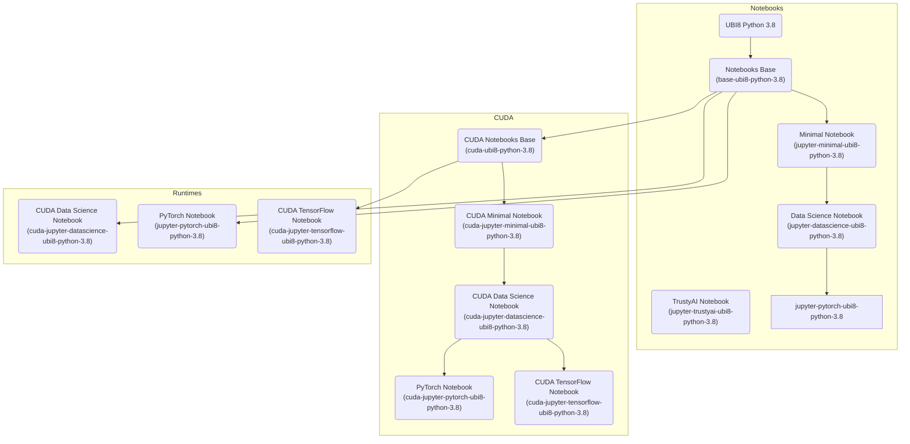
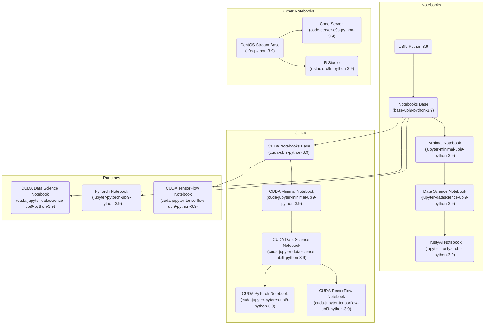

# Notebook Images

These images were created to be used with Open Data Hub (ODH) with the ODH Notebook Controller as the launcher.

## Container Image Layering

The different notebooks images available are built in this order:

**Based on Python 3.8**



**Based on Python 3.9**



## Building

The following workbench images are available:

### Python 3.8
- jupyter-minimal-ubi8-python-3.8
- jupyter-datascience-ubi8-python-3.8
- jupyter-pytorch-ubi8-python-3.8
- cuda-jupyter-minimal-ubi8-python-3.8
- cuda-jupyter-datascience-ubi8-python-3.8
- cuda-jupyter-tensorflow-ubi8-python-3.8
- runtime-datascience-ubi8-python-3.8
- runtime-pytorch-ubi8-python-3.8
- cuda-runtime-tensorflow-ubi8-python-3.8

### Python 3.9
- jupyter-minimal-ubi9-python-3.9
- jupyter-datascience-ubi9-python-3.9
- jupyter-pytorch-ubi9-python-3.9
- jupyter-trustyai-ubi9-python-3.9
- cuda-jupyter-minimal-ubi9-python-3.9
- cuda-jupyter-datascience-ubi9-python-3.9
- cuda-jupyter-tensorflow-ubi9-python-3.9
- runtime-datascience-ubi8-python-3.9
- runtime-pytorch-ubi8-python-3.9
- cuda-runtime-tensorflow-ubi8-python-3.9
- code-server-c9s-python-3.9
- r-studio-c9s-python-3.9;

If you want to manually build a workbench image, you can use the following
command:

```shell
make ${WORKBENCH_NAME}
```

The image will be built and pushed to the
[quay.io/opendatahub/workbench-images](https://quay.io/opendatahub/workbench-images)
repository.

You can overwrite `IMAGE_REGISTRY` and `RELEASE` variables to use a different registry or release tag:

```shell
make ${WORKBENCH_NAME} -e IMAGE_REGISTRY=quay.io/${YOUR_USER}/workbench-images -e RELEASE=2023x
```

## Testing Notebooks

Deploy the notebook images in your Kubernetes environment using deploy8-${NOTEBOOK_NAME} for ubi8 or deploy9-${NOTEBOOK_NAME} for ubi9:

```shell
make deployX-${NOTEBOOK_NAME}
```

Run the test suite against this notebook:

```shell
make test-${NOTEBOOK_NAME}
```

Clean up the environment when the tests are finished:

```shell
make undeployX-${NOTEBOOK_NAME}
```

## Validating Runtimes

The runtimes image requires to have curl and python installed,
so that on runtime additional packages can be installed. 

Deploy the runtime images in your Kubernetes environment using deploy8-${WORKBENCH_NAME} for ubi8 or deploy9-${WORKBENCH_NAME} for ubi9:

```shell
make deployX-${WORKBENCH_NAME}
```

Run the validate test suit for checking compatabilty of runtime images:

```shell
make validate-runtime-image image=<runtime-image>
```

Clean up the environment when the tests are finished:

```shell
make undeployX-${WORKBENCH_NAME}
```

## Contributions
Please refer [CONTRIBUTING.md](CONTRIBUTING.md) file.
