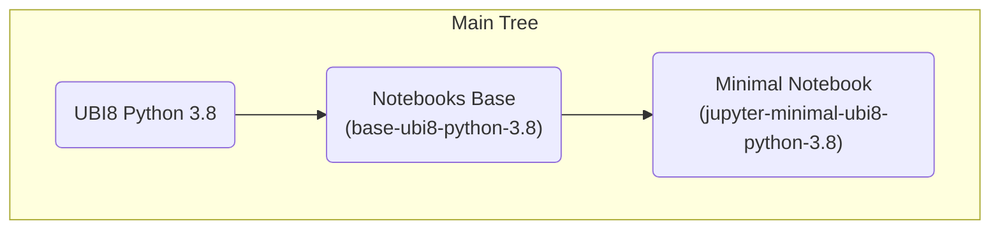

# Notebook Images

These images were created to be used with Open Data Hub (ODH) with the ODH Notebook Controller as the launcher.

## Container Image Layering
 


### Building base-ubi8-python-3.8 image

We use the Red Hat UBI image [registry.access.redhat.com/ubi8/python-38](https://catalog.redhat.com/software/containers/ubi8/python-38/5dde9cacbed8bd164a0af24a) as builder image for the notebook base.

Build the `base-ubi8-python-3.8` by running the following command:

```shell
make base-ubi8-python-3.8
```

The image will be built and pushed to the [quay.io/opendatahub/notebooks](https://quay.io/opendatahub/notebooks) repository.

You can use a different registry by overwriting the `IMAGE_REGISTRY` variable:

```shell
make -e IMAGE_REGISRY=quay.io/YOUR_USER/notebooks base-ubi8-python-3.8
```

### Building jupyter-minimal-ubi8-python-3.8 image

The jupyter-minimal-ubi8-python-3.8 is a lightweight image for running the Jupyter notebook server.

We use the base-ubi8-python-3.8 image [quay.io/opendatahub/notebooks:base-ubi8-python-3.8](https://quay.io/repository/opendatahub/notebooks?tab=tags) as the base image.

Build the `jupyter-minimal-ubi8-python-3.8` by running the following command:

```shell
make jupyter-minimal-ubi8-python-3.8
```

The image will be built and pushed to the [quay.io/opendatahub/notebooks](https://quay.io/opendatahub/notebooks) repository.

You can use a different registry by overwriting the `IMAGE_REGISTRY` variable:

```shell
make -e IMAGE_REGISRY=quay.io/YOUR_USER/notebooks jupyter-minimal-ubi8-python-3.8
```
