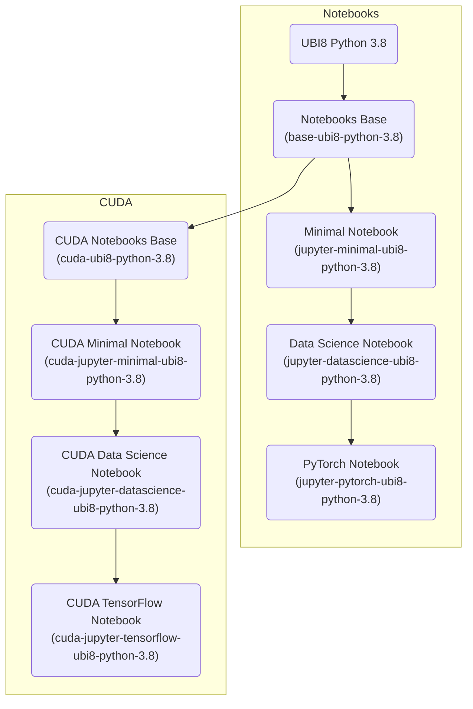

# Notebook Images

These images were created to be used with Open Data Hub (ODH) with the ODH Notebook Controller as the launcher.

## Container Image Layering

The different notebooks images available are built in this order:

**Based on Python 3.8**



**Based on Python 3.9**


## Building

The following notebook images are available:

### Python 3.8
- jupyter-minimal-ubi8-python-3.8
- jupyter-datascience-ubi8-python-3.8
- jupyter-pytorch-ubi8-python-3.8
- cuda-jupyter-minimal-ubi8-python-3.8
- cuda-jupyter-datascience-ubi8-python-3.8
- cuda-jupyter-tensorflow-ubi8-python-3.8

### Python 3.9
- jupyter-minimal-ubi9-python-3.9
- jupyter-datascience-ubi9-python-3.9
- jupyter-pytorch-ubi9-python-3.9
- cuda-jupyter-minimal-ubi9-python-3.9
- cuda-jupyter-datascience-ubi9-python-3.9
- cuda-jupyter-tensorflow-ubi9-python-3.9

If you want to manually build a notebook image, you can use the following
command:

```shell
make ${NOTEBOOK_NAME}
```

The image will be built and pushed to the
[quay.io/opendatahub/notebooks](https://quay.io/opendatahub/notebooks)
repository.

You can use a different registry by overwriting the `IMAGE_REGISTRY` variable:

```shell
make ${NOTEBOOK_NAME} -e IMAGE_REGISTRY=quay.io/${YOUR_USER}/notebooks
```

## Testing

Deploy the notebook images in your Kubernetes environment using deploy8-${NOTEBOOK_NAME} for ubi8 or deploy9-${NOTEBOOK_NAME} for ubi9:

```shell
make deployX-${NOTEBOOK_NAME}
```

Run the test suite against this notebook:

```shell
make test-${NOTEBOOK_NAME}
```

Clean up the environment when the tests are finished:

```shell
make undeployX-${NOTEBOOK_NAME}
```

For further information please see [CONTRIBUTING.md](CONTRIBUTING.md) file.
