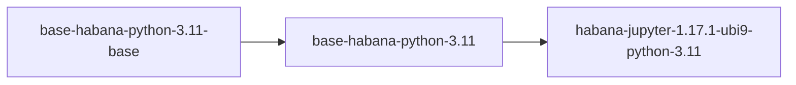

# Habana 1.17.1

The official Habana 1.17.1 image, relies in a repository - they call it Vault - and the internet connection is kind of slow (at least at this moment).

The main idea is to have their image in our build process, so it can be optimized and we can have more control of what is in our image, in case they change something (we might need to keep this up-to-date, of course, but will make our process more reliable for our purposes)

The upstream repository is [https://github.com/HabanaAI/Setup_and_Install/tree/r1.17.1/dockerfiles](https://github.com/HabanaAI/Setup_and_Install/tree/r1.17.1/dockerfiles)

## Habana 1.17.1 image structure

The Habana repository follows the following structure (in the [HabanaAI/Setup_and_Install/dockerfiles](https://github.com/HabanaAI/Setup_and_Install/tree/r1.17.1/dockerfiles) path):

<pre>
├── base
│    ├── Dockerfile.rhel9.4
│    ├── install_efa.sh
│    ├── LICENSE
│    ├── Makefile
├── common.mk
├── pytorch ---- (not used here)
└── triton ---- (not used here)
</pre>

We will replicate most of this structure inside the "habana-1.17.1-python-3.11-base" folder, in a way that this description remains consistent with what is provided by Habana.

We will go through the list explaining the functionality of each script, so there is a clear understanding of why they are present here as well:

### List of files and their functionalities

#### - common.mk

This file contains the ARTIFACTORY_URL, RELEASE_VERSION and RELEASE_BUILD_ID variable.

We will add them directly to the Dockerfile, but this file will remain here only as reference, as our build will be direct, not using their build commands.

#### - base/Dockerfile.rhel9.4

This is the Dockerfile used as base for the Habana AI 17.1.1 installation on top of RHEL 9.4.

> Note: Two commands needed to be added to make the build comply with our build process:

```
# --nobest flag added
$ dnf update -y --nobest

# --no-same-owner flag added to make it work in non-root containers
$ cd /tmp/ \&\& tar xf /tmp/libfabric-${LIBFABRIC_VERSION}.tar.bz2 --no-same-owner
```

#### - base/Makefile

This Makefile configures the build directory so Habana images can be built properly on Habana CI system. We will not use it, as we will build it with our own build system (notebooks repository with github actions)

#### - base/install_efa.sh

An Elastic Fabric Adapter (EFA) is a network device that you can attach to your Amazon EC2 instance to accelerate High Performance Computing (HPC) and machine learning applications. EFA enables you to achieve the application performance of an on-premises HPC cluster, with the scalability, flexibility, and elasticity provided by the AWS Cloud.

Habana requires EFA to optimize the workloads under its hardware.

More information available at: [https://docs.aws.amazon.com/AWSEC2/latest/UserGuide/efa.html](https://docs.aws.amazon.com/AWSEC2/latest/UserGuide/efa.html)

### Habana build process

As it was mentioned before, we will rely in the Notebook's official build process to build those images.

The following code has been added to notebook's Makefile:

```
# Build and push all 3 images related to Habana 1.17.1:
#   - base-habana-python-3.11-base
#   - base-habana-python-3.11
#   - habana-jupyter-1.17.1-ubi9-python-3.11
#
.PHONY: base-habana-1.17.1-python-3.11-base
base-habana-1.17.1-python-3.11-base:
	$(call image,$@,base/habana-1.17.1-python-3.11-base)

.PHONY: base-habana-1.17.1-python-3.11
base-habana-1.17.1-python-3.11: base-habana-1.17.1-python-3.11-base
	$(call image,$@,base/habana-1.17.1-python-3.11)

.PHONY: habana-jupyter-1.17.1-ubi9-python-3.11
habana-jupyter-1.17.1-ubi9-python-3.11: base-habana-1.17.1-python-3.11
	$(call image,$@,habana/1.17.1/ubi9-python-3.11,$<)
```

This created a dependency across our images, in a way that:



To build it properly, follow these steps:

```bash
$ git clone git@github.com:opendatahub-io/notebooks.git
$ cd notebooks/
$ export QUAY_IO=quay.io/{myuser}/workbench-images
$ export WORKBENCH_RELEASE=2024a
$ make habana-jupyter-1.17.1-ubi9-python-3.11 \
    -e IMAGE_REGISTRY=$QUAY_IO \
    -e RELEASE=$WORKBENCH_RELEASE \
    -e PUSH_IMAGES=no \
    -e CONTAINER_BUILD_CACHE_ARGS=""
$ export LATEST_TAG=`podman images --format "{{.Repository}}:{{.Tag}}" | \
                       grep "$QUAY_IO:habana-jupyter-1.17.1-ubi9-python-3.11-$WORKBENCH_RELEASE" | \
                       sort -r | head -n1 | cut -d':' -f2`
$ podman run -it -p 8888:8888 $QUAY_IO:$LATEST_TAG
```
