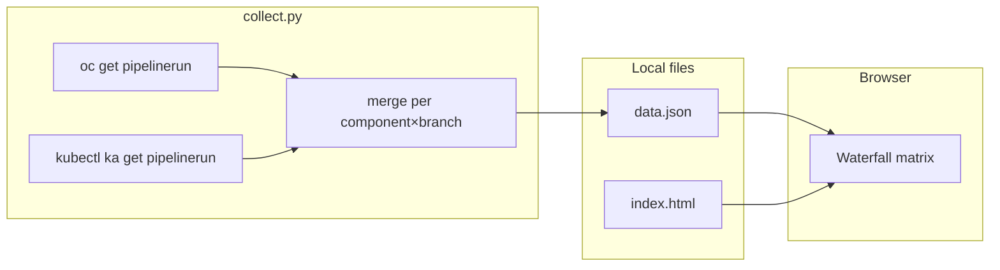

# Notebooks Workbench Build Waterfall — As-Implemented Spec

**Status:** prototype (local-only)  
**Location:** `ci/waterfall/`  
**Last updated:** 2026-07-28  

Design inspiration: [Buildbot Waterfall View](https://docs.buildbot.net/latest/manual/configuration/www/ui/waterfall_view.html).

---

## 1. Purpose

Provide a **Buildbot-style matrix** of Konflux container **build** PipelineRuns for images built from this repository:

- **Rows:** target branch / release stream (e.g. `main`, `rhoai-3.6-ea.1`)
- **Columns:** workbench or runtime component (18 canonical columns)
- **Cells:** latest known build status for that branch × component, with a deep-link to Konflux UI

Scope is **notebooks-team images only** — not operator, controller, FBC fragments, or other tenants' components.

---

## 2. Architecture



| Layer | File | Role |
|-------|------|------|
| Collector | `collect.py` | Queries Konflux via `oc` + KubeArchive; writes `data.json` |
| Data | `data.json` | Snapshot consumed by the UI (gitignored in normal use) |
| UI | `index.html` | Single-page matrix; `fetch('data.json')` |
| UI | `waterfall.html` | Buildbot-style timeline; `fetch('data.json')` |
| Ops | `README.md` | Quick start |

**Not in scope (as implemented):** hosted deployment, auth, auto-refresh, CI integration, Prometheus, Tekton Results API.

---

## 3. Clusters and tenants

| Key | OpenShift cluster | Konflux UI | Namespace | VPN |
|-----|-------------------|------------|-----------|-----|
| `odh` | `stone-prd-rh01` | `konflux-ui.apps.stone-prd-rh01.pg1f.p1.openshiftapps.com` | `open-data-hub-tenant` | No |
| `rhds` | `stone-prod-p02` | `konflux-ui.apps.stone-prod-p02.hjvn.p1.openshiftapps.com` | `rhoai-tenant` | Yes |

`collect.py` resolves `oc` context by grepping `oc config get-contexts -o name` for the cluster substring (`stone-prd-rh01` / `stone-prod-p02`).

---

## 4. Data collection (`collect.py`)

### 4.1 Design constraints

1. **Do not overload Konflux.** The RHOAI DevOps `rhoai-monitoring` exporter was disabled in Jul 2026 after saturating Tekton Results and causing Konflux UI 504s ([KFLUXSPRT-8417](https://redhat.atlassian.net/browse/KFLUXSPRT-8417)). This collector must not repeat broad Results polling.
2. **Prometheus is not used.** `prometheus_metrics` is always emitted as `[]`. Stale Pushgateway data is intentionally ignored.
3. **Bounded API fan-out.** Per cluster: **1** live `oc` list + **N** KubeArchive queries where **N = canonical workbench/runtime components × tracked streams** (component label selectors, not application-wide lists).

Typical call volume per `collect.py` run:

| Cluster | Live `oc` | KubeArchive component queries | ~Total calls |
|---------|-----------|-------------------------------|--------------|
| ODH | 1 | 18 (`*-ubi9`) | 19 |
| RHDS | 1 | 95 (19 stems × 5 streams; llmcompressor + truncated `odh-wb-` on RHDS) | 96 |

**~115 API calls total**, up to 8 parallel KA workers. Runtime ~2–8 minutes (KubeArchive latency dominates). See [PERFORMANCE.md](PERFORMANCE.md) for point-in-time measurements.

### 4.2 Tracked release streams

**RHDS** — fixed Konflux applications (no `oc get applications` discovery):

| Application | Branch |
|-------------|--------|
| `rhoai-v2-25` | `rhoai-2.25` |
| `rhoai-v3-3` | `rhoai-3.3` |
| `rhoai-v3-4` | `rhoai-3.4` |
| `rhoai-v3-5` | `rhoai-3.5` |
| `rhoai-v3-6-ea-1` | `rhoai-3.6-ea.1` |

Ancient streams (`rhoai-v2-13`, `rhoai-v3-2`, `rhoai-v3-5-ea-2`, …) are **not** queried.

**ODH** — `opendatahub-builds` only; branches:

- `main` (push builds)
- `PR@main` (`pull_request` events with `target_branch: main`)

### 4.3 Live PipelineRuns (`source: "live"`)

```bash
oc get pipelinerun -n <namespace> \
  -l pipelines.appstudio.openshift.io/type=build \
  -o json
```

Client-side filter:

- Component label matches workbench/runtime patterns (see §5)
- Excludes `workbenches-operator` / `workbenches-controller`

Captures in-flight and recently completed runs still present in the cluster (before GC; Konflux typically keeps ~3 runs per component). Filtered to **tracked branches** only (§4.2).

### 4.4 Archived PipelineRuns (`source: "archived"`)

```bash
kubectl ka get pipelineruns -n <namespace> --archived=true \
  -l pipelines.appstudio.openshift.io/type=build,appstudio.openshift.io/component=<component> \
  -o json
```

Component names are derived from `NOTEBOOK_COMPONENT_STEMS` in `collect.py`:

- **ODH:** `{stem}-ubi9` (18 components)
- **RHDS:** `{stem}-{version}` per tracked application (`rhoai-v2-25` → `-v2-25`, …), plus optional `odh-wb-jupyter-pytorch-llmcompressor-cuda-py312-{version}` where RHDS uses the truncated name

**Why component selectors:** application-wide KubeArchive queries are capped at 100 results; for streams like `rhoai-v2-25` the newest 100 archived runs are often operator/FBC builds, so workbench history never appears. Component labels avoid that cap conflation.

Filtered to **tracked branches** only (§4.2).

Timeouts (`collect.py` constants): `oc` 180s, `kubectl ka` 600s per component query, `oc config get-contexts` 30s; `KA_WORKERS=8` for parallel archived fetches. On timeout, the call is skipped with a warning (collector continues).

### 4.5 Merge semantics

Entries are keyed by `(component, version row)` where version row is `branch`, or `PR@{branch}` for pull requests (so `main` and `PR@main` stay separate rows).

For duplicate keys:

1. Higher **source rank** wins: `live` (2) > `archived` (1)
2. Same source → newer `metadata.creationTimestamp` wins

### 4.5 Output schema (`data.json`)

```json
{
  "generated_at": "2026-07-28T11:23:00+00:00",
  "source": "oc+kubearchive",
  "prometheus_metrics": [],
  "live_pipelineruns": {
    "odh": [ /* PipelineRunEntry[] — latest per component×branch */ ],
    "rhds": [ /* PipelineRunEntry[] */ ]
  },
  "pipelinerun_history": {
    "odh": [ /* PipelineRunEntry[] — up to 50 per component×branch, for timeline */ ],
    "rhds": [ /* PipelineRunEntry[] */ ]
  }
}
```

**PipelineRunEntry** (per merged row):

| Field | Type | Description |
|-------|------|-------------|
| `name` | string | PipelineRun metadata.name |
| `component` | string | Label `appstudio.openshift.io/component` |
| `application` | string | Label `appstudio.openshift.io/application` |
| `sha` | string | Label `pipelinesascode.tekton.dev/sha` |
| `branch` | string | Annotation `build.appstudio.redhat.com/target_branch` |
| `event_type` | string | e.g. `push`, `pull_request`, `test-comment` |
| `status` | string | Condition `Succeeded.status` (`True` / `False` / `Unknown`) |
| `reason` | string | Condition `Succeeded.reason` (e.g. `Running`, `Succeeded`) |
| `start` | string? | ISO timestamp |
| `completion` | string? | ISO timestamp |
| `created` | string | metadata.creationTimestamp |
| `cluster` | string | `odh` or `rhds` |
| `source` | string | `live` or `archived` |
| `ui_url` | string | Konflux component activity URL |

`ui_url` pattern:

```
{ui_base}/ns/{namespace}/applications/{application}/components/{component}/activity/pipelineruns
```

---

## 5. Component scope

### 5.1 Included (18 columns)

**Workbenches (11):**

| Column ID | Konflux component pattern |
|-----------|---------------------------|
| `minimal-cpu` | `jupyter-minimal-cpu`, `rstudio-minimal-cpu` |
| `minimal-cuda` | `jupyter-minimal-cuda`, `rstudio-minimal-cuda` |
| `minimal-rocm` | `jupyter-minimal-rocm` |
| `datascience-cpu` | `jupyter-datascience-cpu` |
| `pytorch-cuda` | `jupyter-pytorch-cuda`, `wb-jupyter-pytorch-cuda` |
| `pytorch-rocm` | `jupyter-pytorch-rocm`, `wb-jupyter-pytorch-rocm` |
| `pytorch-llm-cuda` | `jupyter-pytorch-llmcompressor`, `wb-jupyter-pytorch-llmcompressor` |
| `tensorflow-cuda` | `jupyter-tensorflow-cuda` |
| `tensorflow-rocm` | `jupyter-tensorflow-rocm` |
| `trustyai-cpu` | `trustyai-cpu` |
| `codeserver-cpu` | `codeserver-datascience-cpu` |

**Pipeline runtimes (7):**

| Column ID | Konflux component pattern |
|-----------|---------------------------|
| `rt-minimal-cpu` | `pipeline-runtime-minimal-cpu` |
| `rt-datascience` | `pipeline-runtime-datascience-cpu` |
| `rt-pytorch-cuda` | `pipeline-runtime-pytorch-cuda` |
| `rt-pytorch-rocm` | `pipeline-runtime-pytorch-rocm` |
| `rt-pytorch-llm` | `pipeline-runtime-pytorch-llmcompressor` |
| `rt-tf-cuda` | `pipeline-runtime-tensorflow-cuda` |
| `rt-tf-rocm` | `pipeline-runtime-tensorflow-rocm` |

Pattern order in `index.html` matters: **runtime and codeserver patterns are matched before generic `minimal-cpu` / `datascience-cpu`** to avoid column collisions.

### 5.2 Excluded

| Pattern | Reason |
|---------|--------|
| `workbenches-operator` | Different team / repo |
| `workbenches-controller` | Different team / repo |
| Non-build PipelineRuns | Filtered by `pipelines.appstudio.openshift.io/type=build` |
| Integration tests, Conforma-only runs | Same build-type filter; Conforma registry runs lack workbench component labels |

Collector regex gate: `odh-workbench-`, `odh-wb-`, or `odh-pipeline-runtime-` in component name.

---

## 6. UI (`index.html`)

### 6.1 Matrix layout

- **Rows:** unique `version` labels from entries
  - Live/archived: `branch`, or `PR@{branch}` for `event_type === pull_request'`, or `live` if no branch
- **Columns:** unique short component names, ordered by `COMPONENT_ORDER`
- **Cells:** one entry per `(version, short)` after source-priority merge in the UI

### 6.2 Cell status

| Display | CSS class | Condition |
|---------|-----------|-----------|
| ✓ | `success` | `status === 'True'` or Prometheus `success === 1` |
| ✗ | `failed` | `status === 'False'` or Prometheus `success === 0` |
| ⟳ | `running` | `reason === 'Running'` |
| ? | `unknown` | otherwise |
| ~ | `stale` | Prometheus only: `last_run_ts` older than 3 days (unused while Prometheus disabled) |
| — | `missing` | no entry for that row×column |

### 6.3 Source priority (UI merge)

When multiple entries map to the same cell:

`live` (3) > `archived` (2) > `prometheus` (1)

> **Known gap:** the UI loop over `live_pipelineruns` currently hardcodes `source: 'live'` instead of reading `run.source` from JSON. Collector-side merge usually leaves one entry per cell, so impact is limited; archived tooltips may not appear.

### 6.4 Interactions

- **Clickable cells:** entire cell is an `<a href="{ui_url}">` opening Konflux component activity in a new tab
- **Tooltips:** component, branch, SHA prefix, status, event type; archived/Prometheus stale hints when applicable
- **Filters:**
  - **Cluster:** `all` | `odh` | `rhds`
  - **Version:** branch names from collected data (`prometheus_metrics` also supported if re-enabled)
  - **Status:** `all` | `success` | `failed` | `running` | `unknown` | `stale`

> **Known gap:** version filter is applied to Prometheus entries but **not** to `live_pipelineruns` entries in `renderWaterfall()`.

### 6.5 Konflux deep-link logic (RHDS)

RHDS components often carry a version suffix matching the application:

- Application `rhoai-v3-3` → component `odh-workbench-jupyter-minimal-cuda-py312-v3-3`
- Application `rhoai-v3-6-ea-1` → component `…-v3-6-ea-1`

UI appends `-{versionSuffix}` when `instance === stone-prod-p02'` and component does not already end with the suffix.

### 6.6 Stats bar

Counts entries after filters: Total, Success, Failed, Running, Stale (if any).

---

## 7. Timeline waterfall (`waterfall.html`)

Buildbot-style view ([reference](https://docs.buildbot.net/latest/manual/configuration/www/ui/waterfall_view.html)): **one branch/release at a time**, components as columns, **time on the vertical axis** (newest at top).

### 7.1 Data source

Uses `pipelinerun_history` from `data.json` (falls back to `live_pipelineruns` if history absent). History contains up to **50** runs per `(component, branch row)` from live + KubeArchive (`HISTORY_MAX_PER_KEY` in `collect.py`).

### 7.2 Layout

Buildbot-style **summary header** (sticky above timeline):

1. **Component columns** — 18 canonical shorts (`COMPONENT_ORDER`), only columns with history shown
2. **Last build** — newest completed PipelineRun per column (not `Running`); label + short SHA; links to Konflux
3. **Current** — in-flight build per column (`reason: Running`); shows `building` + elapsed time; `idle` if none
4. **Timeline** — history below summary rows

Timeline details:

- **Bars:** positioned by `start` / `completion` on a **piecewise time scale**; solid segment at the **bottom** of each slot = duration; lighter fill extends **upward** to the next newer build (or timeline top)
- **Idle gaps:** global gaps with no builds in any column longer than **12h** compress to a fixed `—//—` break band; active periods keep ~8 min/px
- **Colors:** success / failed / running / unknown (same semantics as matrix); slot uses ~18% opacity tint, bar is solid
- **SHA waves:** optional dashed horizontal bands when ≥2 components share the same commit SHA
- **Time axis:** ticks at segment boundaries (and within tall active regions); aligned with column body below the sticky header

### 7.3 Filters

- **Cluster:** `odh` | `rhds` (one cluster at a time)
- **Branch / release:** `main`, `rhoai-3.6-ea.1`, `PR@main`, etc.
- **Event:** push only | all | PR only

---

## 8. Operator workflow

```bash
cd ci/waterfall

# 1. Prerequisites: oc logged in (both clusters), kubectl-ka installed, VPN for RHDS
oc whoami --context=...stone-prod-p02...

# 2. Collect
python3 collect.py

# 3. Serve
python3 -m http.server 8888

# 4. Open
open http://localhost:8888           # matrix
open http://localhost:8888/waterfall.html   # timeline
```

Re-run `collect.py` and hard-refresh the browser to update.

---

## 9. Authentication and credentials

| Tool | Auth |
|------|------|
| `oc` | User kubeconfig (personal login); maintainer role on tenant |
| `kubectl ka` | Same kubeconfig; uses Konflux KubeArchive plugin |
| Prometheus | **Not used** |
| Vault / GitLab tokens | **Not used** by this prototype |

See also: [guide/docs/notebooks/konflux/internal-systems-access.md](../../../guide/docs/notebooks/konflux/internal-systems-access.md), [guide/docs/notebooks/konflux/kubearchive.md](../../../guide/docs/notebooks/konflux/kubearchive.md).

---

## 10. Limitations (as implemented)

| Limitation | Detail |
|------------|--------|
| **No historical SHA waves** | One cell = latest known run per branch×component; not a time-series waterfall |
| **GC gap** | Runs absent from both live cluster and KubeArchive window show as `—` |
| **KA per-component history** | Each component query returns up to 100 archived runs (newest first); sufficient for latest-status matrix |
| **RHDS app filter** | Only five supported streams (2.25, 3.3–3.5, 3.6-ea.1); no ancient 2.x |
| **ODH branch filter** | Only `main` and `PR@main`; not `stable` / `candidate` |
| **PR rows** | Included; labeled `PR@{branch}` when `event_type === pull_request'` |
| **Multi-arch granularity** | Cell is overall PipelineRun success; per-arch TaskRun status not shown |
| **Prometheus path dormant** | UI still contains Prometheus + stale logic; collector emits empty array |
| **Subtitle drift** | Page subtitle still mentions Prometheus; collector does not use it |
| **Version filter incomplete** | Branch dropdown does not filter live/archived rows in UI |
| **No auto-poll** | Manual `collect.py` + browser refresh only |
| **Local only** | No published endpoint; `data.json` reflects collector's machine clock and RBAC |

---

## 11. Related documentation

| Doc | Topic |
|-----|-------|
| [README.md](README.md) | Quick start |
| [guide/docs/notebooks/konflux/kubearchive.md](../../../guide/docs/notebooks/konflux/kubearchive.md) | KubeArchive queries, build-wave labels |
| [guide/docs/notebooks/konflux/rhoai-monitoring-o11y.md](../../../guide/docs/notebooks/konflux/rhoai-monitoring-o11y.md) | Disabled Prometheus exporter (why we avoid it) |
| [guide/docs/notebooks/konflux/tektonresults.md](../../../guide/docs/notebooks/konflux/tektonresults.md) | Results API saturation incident |
| `.cursor/plans/konflux_build_waterfall_*.plan.md` | Original design / future phases |

---

## 12. Future work (not implemented)

Tracked in planning docs, not in this prototype:

- Fix UI: honor `run.source`, apply version filter to all entry types, update subtitle
- Optional Prometheus re-enable behind a flag when exporter migrates to KubeArchive
- Per-SHA wave view using KubeArchive commit labels (`pipelinesascode.tekton.dev/sha`)
- Published static snapshot (GitLab Pages / internal host) with scheduled collector
- Dedicated `konflux-waterfall-reader` ServiceAccount (see plan auth section)
