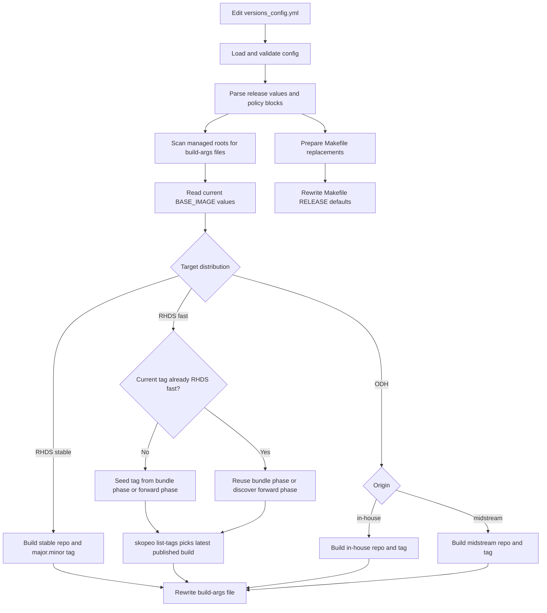

# Base Image Version Update Configuration

## Purpose

This repository uses `versions_config.yml` as the single operator input for base
image version updates.

The sync flow validates that configuration, resolves the target base image for
every managed notebook image family, rewrites managed `build-args/*.conf` files,
and updates the root `Makefile` release defaults. The implementation lives in
`scripts/update_build_args_from_versions.py`, and the standard entry point is
`make sync-build-args-from-versions`.

## What This Flow Manages

The sync flow manages:

- `BASE_IMAGE` in image-tree `build-args/*.conf` files under `jupyter/`,
  `runtimes/`, and `codeserver/`
- `RELEASE` in managed `build-args/*.conf` files when that key is already present
- root `Makefile` `RELEASE`
- root `Makefile` `RELEASE_PYTHON_VERSION`

It does not update unrelated files or regenerate lock files. If the image update
also requires Python lock refreshes, run `make refresh-lock-files` separately.

The script only manages known build-args filenames:

- `cpu.conf`, `cuda.conf`, `rocm.conf`
- `konflux.cpu.conf`, `konflux.cuda.conf`, `konflux.rocm.conf`

If an unexpected `build-args` filename appears in a managed tree, the sync fails
early instead of guessing.

## Prerequisites

- `uv` available through the repo wrapper commands
- `skopeo` on `PATH` for RHDS `channel: fast` resolution
- access to the Quay repositories referenced by the configured RHDS and ODH policies

## How the Sync Flow Works




At a high level, the script first validates `versions_config.yml`, then scans the
managed image trees for known `build-args/*.conf` files. For each target, it
reads the current `BASE_IMAGE`, chooses the correct RHDS or ODH resolution rule,
computes the desired image reference, and rewrites only the managed assignments.

For RHDS `channel: fast`, the current repo state matters. The script uses the
existing RHDS fast peers to infer same-release bundle phase when appropriate, and
it uses `skopeo list-tags` to resolve the latest published build in the selected
family.

## Configuration Model

The sync flow expects `schema_version: 1` and the following top-level structure:

```yaml
schema_version: 1

release:
  full_version: "3.5.0"
  rhds_os_base: "el9.6"
  python_version: "3.12"

artifacts:
  base_image:
    cpu:
      rhds:
        channel: fast
        version: "<full_version>"
      odh:
        origin: in-house
        version: "latest"

    cuda:
      minimal:
        acc_version: "13.0"
        rhds:
          channel: fast
        odh:
          origin: in-house
```

### Release Fields

- `release.full_version` drives RHDS release selection and the managed
  `RELEASE` value written to build-args files and the root `Makefile`
- `release.rhds_os_base` selects the RHDS CUDA and ROCm repository suffix such as
  `el9.6`
- `release.python_version` selects the managed `RELEASE_PYTHON_VERSION` value and
  drives CPU ODH repository naming

### Policy Keys

- CPU policies use `version`
- CUDA and ROCm flavors use shared `acc_version`
- RHDS policies use `channel`
- ODH policies use `origin`

Validation is strict. Unexpected keys, missing required keys, invalid channel or
origin values, malformed versions, and invalid distribution-specific combinations
fail before any file is rewritten.

## RHDS Resolution Rules

### `channel: stable`

RHDS stable targets do not take `version` or nested `acc_version`. The script derives a
stable image from `release.full_version`:

- CPU: `quay.io/aipcc/base-image-cpu-stable-ubi9:<major.minor>`
- CUDA: `quay.io/aipcc/base-image-cuda-stable-ubi9:<major.minor>`
- ROCm: `quay.io/aipcc/base-image-rocm-stable-ubi9:<major.minor>`

For example, `release.full_version: "3.5.0"` resolves stable targets to `:3.5`.

When using `channel: stable`, do not set `version` for CPU and do not set
`acc_version` under `rhds` for CUDA or ROCm. GPU flavors can still define a
shared flavor-level `acc_version` so ODH stays aligned. For stable CUDA and
ROCm targets, the script also inspects the resolved RHDS stable image and logs a
warning if the detected accelerator stream does not match the shared
`acc_version`.

Example:

```yaml
release:
  full_version: "3.5.0"

artifacts:
  base_image:
    cuda:
      minimal:
        acc_version: "13.0"
        rhds:
          channel: stable
```

That resolves to `quay.io/aipcc/base-image-cuda-stable-ubi9:3.5`.

### `channel: fast`

RHDS fast targets require `version` for CPU. CUDA and ROCm use the shared
flavor-level `acc_version`. The script first builds the correct repository
name, then uses `skopeo list-tags` to resolve the latest published build within
the selected release-and-phase family.

Representative repository shapes:

- CPU: `quay.io/aipcc/base-images/cpu`
- CUDA: `quay.io/aipcc/base-images/cuda-13.0-el9.6`
- ROCm: `quay.io/aipcc/base-images/rocm-7.1-el9.6`

### Same-Release Bundle Phase Inference

When a target switches from `stable` or another non-fast tag to `fast` on the
same `release.full_version`, the script inspects the other RHDS fast peers in the
current repo state.

- If same-release peers already show `ea.1`, `ea.2`, or GA tags, the highest
  observed phase wins bundle-wide.
- If no same-release fast-style peer exists yet, the new fast family starts at
  `ea.1`.

This same-release bundle rule is also used to bring lagging same-release RHDS
fast targets up to the bundle phase. For example, if CUDA and ROCm are already
on `ea.2`, a same-release CPU fast target is seeded with `ea.2` rather than
falling back to `ea.1`.

### Forward Upgrade Phase Discovery

When a target moves to a newer `release.full_version`, the script does not reuse
the old bundle phase. Instead, it checks the target repository itself and
selects the highest already-published phase for that new release:

- GA if published
- otherwise `ea.2` if published
- otherwise `ea.1`

After choosing the phase, `skopeo` resolves the latest published build in that
family.

This rule applies to:

- stable or non-fast -> fast transitions that cross into a newer release
- existing RHDS fast targets moving forward to a newer release

The important distinction is:

- same-release transitions use whole-bundle phase inference
- forward-release transitions use per-repository phase discovery

### Rollback Behavior

When `release.full_version` moves backward, RHDS fast rollback targets the older
release in GA first. If that older release has no GA tag, the script falls back
to the highest published phase available for that older release and then resolves
the latest build in that family.

Rollback planning ignores newer-release fast peers. It does not reuse the newer
bundle phase when targeting the older release.

## ODH Resolution Rules

### `origin: in-house`

In-house ODH targets use the normal `quay.io/opendatahub/odh-base-image-*`
repositories.

- CPU repository naming is derived from `release.python_version`, for example
  `quay.io/opendatahub/odh-base-image-cpu-py312-c9s`
- CUDA and ROCm use fixed accelerator family repositories with accelerator stream tags

Examples:

- CPU: `quay.io/opendatahub/odh-base-image-cpu-py312-c9s:latest`
- CUDA: `quay.io/opendatahub/odh-base-image-cuda-py312-c9s:v13.0`
- ROCm: `quay.io/opendatahub/odh-base-image-rocm-py312-c9s:v7.1`

### `origin: midstream`

Midstream ODH targets use `quay.io/opendatahub/odh-midstream-*` repositories.

- CPU still uses `version: "latest"`
- CPU repository naming comes from `release.python_version`, for example
  `quay.io/opendatahub/odh-midstream-python-base-3-12:latest`
- CUDA and ROCm require numeric `acc_version` values and resolve to `:latest`

Examples:

- CPU: `quay.io/opendatahub/odh-midstream-python-base-3-12:latest`
- CUDA: `quay.io/opendatahub/odh-midstream-cuda-base-13-0:latest`
- ROCm: `quay.io/opendatahub/odh-midstream-rocm-base-7-1:latest`

### CPU Version Rule

For CPU ODH, both `origin: in-house` and `origin: midstream` require:

```yaml
cpu:
  odh:
    origin: in-house
    version: "latest"
```

The script rejects any non-`latest` CPU ODH version.

### Example: switch ROCm minimal to midstream

```yaml
rocm:
  minimal:
    acc_version: "7.1"
    odh:
      origin: midstream
```

That resolves to `quay.io/opendatahub/odh-midstream-rocm-base-7-1:latest`.

## Updating Versions

1. Edit `versions_config.yml`.
2. Review the policy block you changed and confirm the right key is used:
   `version` for CPU, shared flavor-level `acc_version` for CUDA or ROCm.
3. Keep RHDS and ODH rules aligned with the target distribution:
   `channel` is RHDS-only and `origin` is ODH-only.
4. Run the sync command.
5. Review the generated diff before committing anything.

### Example: move a ROCm ODH target to origin midstream

```yaml
rocm:
  minimal:
    acc_version: "7.1"
    odh:
      origin: midstream
```

### Example: change the CPU Python to origin in-house

```yaml
...
cpu:
  odh:
    origin: in-house
    version: "latest"
...
```

### Example: change the CUDA Python stable channel

```yaml
...
    cuda:
      minimal:
        acc_version: "13.0"
        rhds:
          channel: stable
...
```
### Example: change the CUDA Python fast channel

```yaml
...
    cuda:
      minimal:
        acc_version: "13.0"
        rhds:
          channel: fast
...
```

That updates CPU ODH repository naming and rewrites the root `Makefile`
`RELEASE_PYTHON_VERSION`.

## Running the Sync

The normal entry point is the `Makefile` target:

```shell
make sync-build-args-from-versions
```

Useful variants:

```shell
make sync-build-args-from-versions SYNC_BUILD_ARGS_ARGS=--dry-run
make sync-build-args-from-versions SYNC_BUILD_ARGS_ARGS=--check
```

For direct script usage, the same flags are available through:

```shell
./uv run scripts/update_build_args_from_versions.py --dry-run
./uv run scripts/update_build_args_from_versions.py --check
```

Advanced flags:

- `--config` to point at a different config file
- `--root` to point at a different repository root

## What to Review After Running

- every changed `build-args/*.conf` still points to the expected repository family
- `BASE_IMAGE` changed only where the policy or published RHDS tags require it
- `RELEASE` in managed build-args files matches the new `release.full_version` minor
- root `Makefile` `RELEASE` and `RELEASE_PYTHON_VERSION` match the new release block
- RHDS fast targets landed on the expected phase family for the scenario:
  same-release bundle alignment, forward upgrade discovery, or rollback fallback

For safe review, start with:

```shell
make sync-build-args-from-versions SYNC_BUILD_ARGS_ARGS=--dry-run
```

## Troubleshooting

- `Unsupported schema_version`: set `schema_version: 1`
- `Missing version` or `Missing acc_version`: check the selected accelerator and policy mode
- `cpu odh ... requires version latest`: restore CPU ODH `version: "latest"`
- invalid `channel` or `origin`: check that RHDS blocks use `channel` and ODH blocks use `origin`
- `skopeo is required to resolve latest RHDS tags`: install `skopeo` and retry
- `skopeo list-tags failed`: confirm network or registry access to the target RHDS repo
- `--check` exit code `1`: the repo needs sync updates; rerun without `--check` or inspect `--dry-run`
