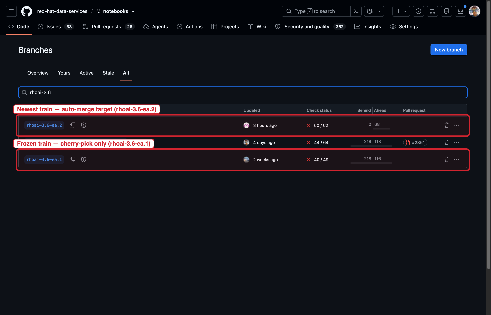
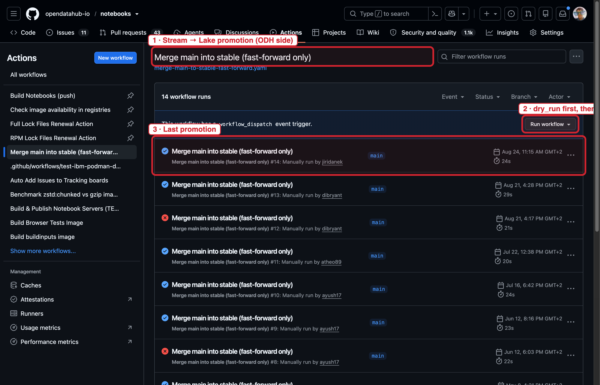
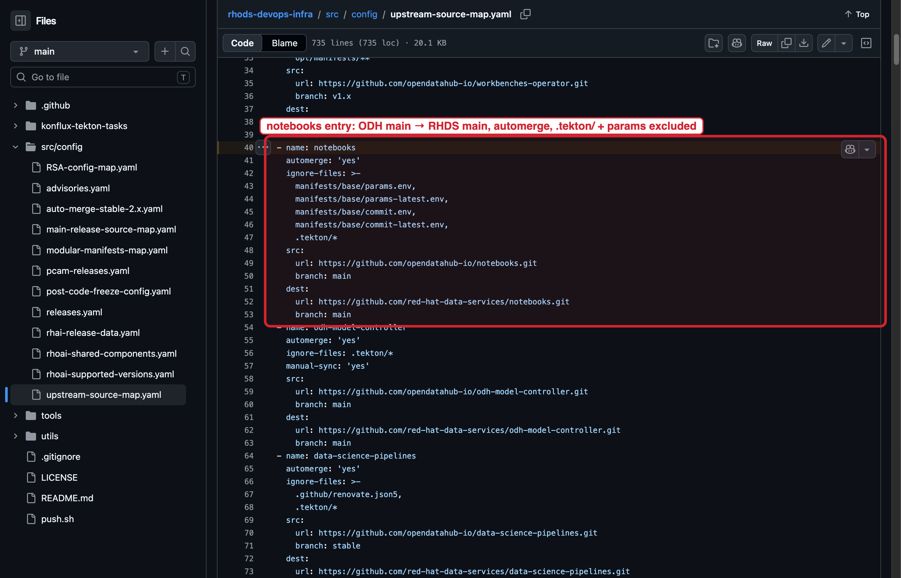
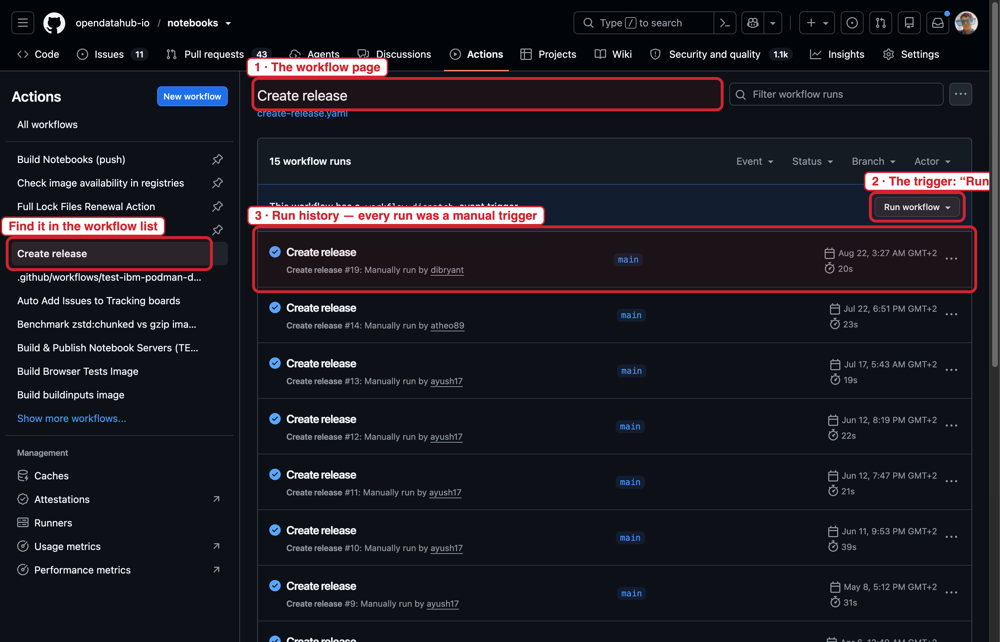
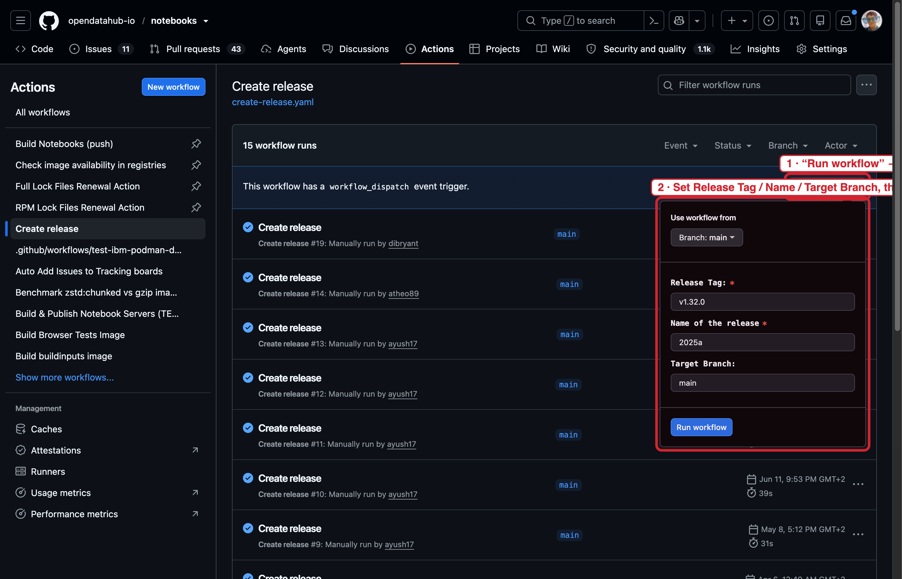
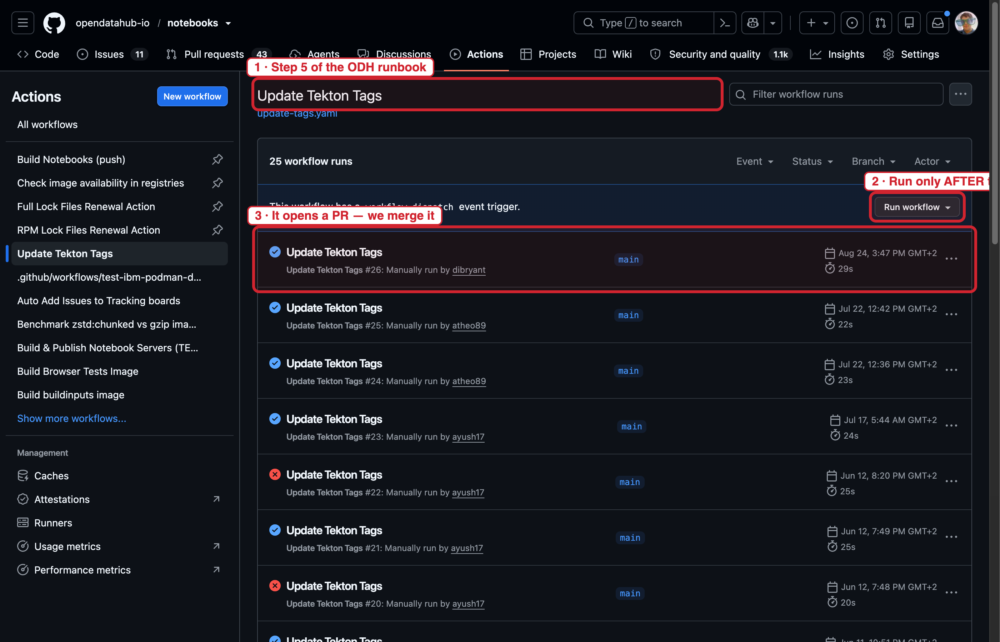
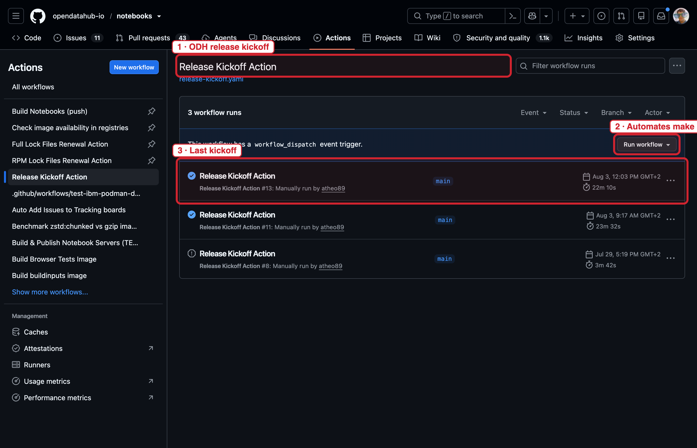
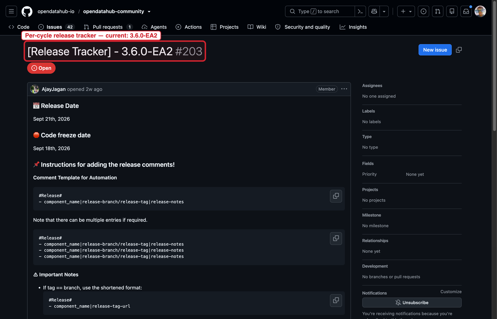

<!-- _class: lead -->

# Notebooks × Bodies of Water

### The Stream → Lake → Ocean release flow — team training

**RHAIENG-1264** · docs PR [opendatahub-io/notebooks#4583](https://github.com/opendatahub-io/notebooks/pull/4583)

<!-- notes:
OPENING (2 min)

Framing: this is the in-team training for the Bodies of Water adoption, part of the
Notebooks adoption epic RHAIENG-1273. The specific ticket this closes (with the docs and
troubleshooting guide) is RHAIENG-1264, "Documentation & Training".

Goal after ~20 minutes: every attendee can (a) say what code goes where, (b) name the gate
that protects each transition, and (c) say exactly what to do when a train freezes and a fix
is still needed. That third item is the one that actually bites us in practice.

Set expectations up front:
- The repo is our single source of truth. We deliberately did NOT create a Google doc for
  Notebooks (other teams did; we chose the docs/-in-repo path so the workflow lives next to
  the code and the CI that enforces it). Everything referenced today is a committed file.
- The deck is orientation, not the doc. After this session the two files people should
  know are docs/bodies-of-water.md (the workflow) and docs/bodies-of-water-troubleshooting.md
  (the fixes). The deck mirrors their section order on purpose.
- Everything in this deck is grounded in verified-live investigation (the PR includes
  docs/code-flow-odh-to-rhoai.md, a mechanism reference verified against the actual repos,
  pipelines, and Slack announcements in August 2026) — not assumptions.

Timebox: ~20 min talk + Q&A. Slides 5 and 6 (train divergence + cherry-picking) are the
heart of the session; don't rush them even if the early ones go fast.
-->

---

# Why "Bodies of Water"

One release strategy, all RHOAI components — **three stages, quality gates, explicit transitions**:

| Stage | Meaning | For us |
|---|---|---|
| **Stream** | Component-owned dev trunk | `main` in `opendatahub-io/notebooks` |
| **Lake** (ODH) | ODH stable — first joint deliverable | `stable` — **ODH Nightly builds here** |
| **Ocean** (RHOAI) | Product-releasable | `rhoai-X.Y` trains in `red-hat-data-services/notebooks` — **RHOAI Nightly + RC/GA** |

<!-- notes:
CONTEXT (2 min)

Where this comes from: the "Bodies of Water" strategy is the shared RHOAI release model
(designed by Andrew Ballantyne, 2025). The original Google doc is the *foundational design* —
it is NOT actively maintained, and phase status for the whole program lives in Jira
(RHOAIENG-28641). Don't send people to the doc for "current" status; send them to the Jira.

Why Red Hat adopted it, in one breath: before BoW every component had its own ad-hoc
upstream→downstream flow. BoW standardizes on three "bodies of water" with explicit quality
gates and explicit transition processes, so every component (operator, dashboard, model
server, notebooks, ...) moves through the same shape of pipeline and the same vocabulary.
The marketing line for Stream is "Your development. Your way." — component teams keep full
autonomy on their trunk.

Walk the table row by row, keeping the emphasis on "for us":
- STREAM = main in opendatahub-io/notebooks (this repo). Nothing is special about it — it's
  where we always develop. The BoW framing just names it.
- LAKE = stable in the same repo. Two things to stress: it is the ODH integration point, and
  ODH Nightly builds come from it. If you want your change in the ODH nightly, it has to be
  on stable — that's the whole Stream→Lake transition.
- OCEAN = the red-hat-data-services/notebooks org: `main` there (Ocean, DevOps-owned) plus
  the `rhoai-X.Y` release trains. RHOAI Nightly, RC, and GA all build from the trains.
  Key subtlety: the trains are fed from ODH `main` (via RHDS `main`), NOT from `stable`.
  `stable` is the ODH-only copy of the same stream.

The signoff: every team signs off its branch mapping in a cross-team signoff table inside
the canonical BoW doc. Ours: Notebooks · Jiri Daněk · 2025-08-05 · Stream=main, Lake=stable,
Ocean=rhoai, RHDS branch=main. If we ever rename a branch, that row must be updated — that's
a standing obligation, not a one-time event.

Likely question: "is ODH also RHOAI?" — No. ODH is the open-data hub distribution (Lake);
RHOAI is the commercial product (Ocean). Both are fed from the same stream (our main): ODH
via stable (fast-forward), RHOAI via RHDS main (auto-sync). The midstream (ODH) side is
where fixes land first by norm.
-->

---

# Branch map

```text
opendatahub-io/notebooks                     red-hat-data-services/notebooks
  main  (Stream) — all dev lands here ─────▶  main  (Ocean) — DevOps-owned
    │ FF-only GHA                              │ auto-merge (newest train only)
    ▼                                          ▼
  stable (Lake) — ODH nightly + GA          rhoai-X.Y (trains) — RHOAI nightly + RC/GA
  2025a/… (ODH GA branches)
```

- `main` → `stable`: **fast-forward only** — "Merge main into stable" GHA (`dry_run` first); feeds **ODH only**
- `main` → RHDS `main` → train: **DevOps auto-sync** (`rhods-devops-infra` GHAs), **newest train only**
- We **never commit directly** to `stable` or to any RHDS branch

<!-- notes:
CONTEXT (3 min) — make people memorize the three rules at the bottom.

Left side (opendatahub-io/notebooks — this repo):
- main: everything lands here first — features, fixes, CVEs, dependency bumps. Prow/Tide
  merges via the merge bot; there is no direct push.
- stable: the ODH integration branch. ODH Nightly is built from stable by Konflux
  (open-data-hub-tenant). The branch's freshness is driven by "release kickoff":
  make kickoff-release (or the "Release Kickoff Action" GitHub Action) applies the
  versions_config.yml overrides and opens a PR. If nobody kicks off, the nightly serves
  whatever stable already had.
- 2025a / 2024b / ...: ODH GA release branches, one per ODH release cycle. Image tags for an
  ODH release are built from these (e.g. a 3.6 ODH release off the 3.6 branch with
  3.6-v1.48-style tags). These are cut per cycle; they are separate from the RHOAI trains —
  don't confuse an ODH GA branch with a rhoai-X.Y train.

Right side (red-hat-data-services/notebooks — downstream):
- main: the Ocean. DevOps owns it. It receives ODH `main` via their auto-sync
  (upstream-source-map.yaml: opendatahub-io/notebooks@main → red-hat-data-services/
  notebooks@main, .tekton/ + params excluded); we don't commit here directly.
- rhoai-X.Y: the release trains (e.g. rhoai-3.5, rhoai-3.6-ea.1, rhoai-3.6-ea.2). Cut from
  RHDS `main` by DevOps onboarding; auto-merge (main-release-auto-merge.yaml) feeds the
  NEWEST train only. Konflux builds run from these branches (never from main), and the
  nudge chain (operator → bundle → FBC fragment) turns green train builds into catalog
  entries. RHOAI Nightly and RC/GA come from the trains.

Emphasize the fan-out: ODH `main` is the single source that feeds BOTH waters — `stable`
(ODH) via fast-forward, and RHDS `main` (→ trains) via auto-sync. `stable` is NOT on the
RHOAI path.

The invariants (repeat these — they're the exam answers):
1. stable must always be an ancestor of main. If it isn't, something was committed to
   stable by hand and the fast-forward workflow will (correctly) refuse to run.
2. We never commit directly to stable, to RHDS main, or to any train. Every change reaches
   those branches through the two mechanisms: the FF workflow (ours) and the auto-sync
   (DevOps').
3. .tekton/ in both repos is synced read-only from konflux-central — never hand-edit it
   (that's in the repo's hard rules too).

Likely question: "why two orgs at all?" — ODH is the midstream we can develop in the open;
RHDS is the product org where the release trains, the AIPCC base images, and the production
catalogs live. The auto-sync is the bridge.
-->

---

# Branch map — RHDS trains (live)

The two 3.6 trains in `red-hat-data-services/notebooks` — **auto-merge targets the newest, the other is frozen**:

{width:88%}

<!-- notes:
CONTEXT (1 min) — the live counterpart of the ASCII map on the previous slide.

Same two branches the divergence rule is about: rhoai-3.6-ea.2 (newest — receives the
RHDS main → train auto-merge) and rhoai-3.6-ea.1 (frozen — cherry-pick only, by us).
The list is filtered on "rhoai-3.6"; the fix/* rows between them are unrelated PR branches.
RHDS main (not in this filtered view) is the DevOps-owned branch that receives ODH main
first — see the sync-config screenshot on the gates slide.
-->

---

# ⚠️ The train-divergence rule

When a **new train is onboarded**, auto-merge from RHDS `main` **switches to it**:

```text
before:  RHDS main ──auto-merge──▶ rhoai-3.6-ea.1
after 3.6-ea.2 onboarded:
  RHDS main ──auto-merge──▶ rhoai-3.6-ea.2     ✅ automatic
  RHDS main ──✋───────────▶ rhoai-3.6-ea.1     ❌ manual, by us
```

- Work on ODH `main` after the cut reaches **only the newest train** automatically (ODH `main` → RHDS `main` → train)
- Anything still needed on an **older (frozen) train**: **we cherry-pick downward — DevOps will not**
- First real occurrence: **2026-08-24 EA1/EA2 onboarding**

<!-- notes:
CONTEXT (4 min) — the most important slide. Slow down here.

The mechanism: DevOps auto-merge from RHDS `main` (main-release-auto-merge.yaml) targets
exactly ONE RHOAI train — the newest onboarded one. When the next train is onboarded, the
switch flips. This is by design: once the new train exists, everything merging to ODH main
is "next release" work and must NOT leak into the frozen train.

The real story (tell it as a story — it's the one people will remember):
- The 3.6 EA1 code freeze was originally 2026-08-21, then moved to 2026-08-31.
- Before that, EA2 (rhoai-3.6-ea.2) was onboarded.
- DevOps announced (Slack, #wg-3_6_ea1-openshift-ai-release, Aug 24 2026): auto-merge now
  targets rhoai-3.6-ea.2 only. EA1 stopped receiving it.
- Consequence we hit immediately: work that had landed on main after the EA1 cut was no
  longer reaching EA1 at all — not because it was wrong, but because the switch had flipped.
- Ownership clarification from the announcement: cherry-picking downward to the frozen train
  is the COMPONENT TEAM's job. DevOps will not do it for us.

Ask the room (make them answer out loud): "A security fix lands on main today. EA1 is still
open and still shipping. What happens?" Correct answer: nothing, automatically. The fix is
on EA2 (and on main/stable). If EA1 needs it, someone cherry-picks it down — and that
someone is us.

If anyone asks "why not just keep auto-merging EA1 too?" — because main keeps moving with
3.7/next-release work after EA1 freezes; keeping the pipe open would leak that into a
frozen train. The divergence IS the freeze mechanism.

Transition: "So how do we do the cherry-pick without producing garbage? Next slide — and
there's a cautionary tale."
-->

---

# Cherry-picking downward, cleanly

1. Branch **from the older train** — never merge a newer train into it
2. Cherry-pick **product commits only** (Dockerfiles, lockfiles, `ci/`, `scripts/`, `manifests/`)
3. **`.tekton/` stays byte-identical to that train** — PipelineRuns are synced per-branch
   from konflux-central and *differ between trains*
4. PR against the older train; review + approve before freeze
5. Verify train builds (expect branch-locked dep fallout)

**The #2806 → #2807 lesson:** an EA2→EA1 merge PR was dirty (foreign `.tekton/` + tag retargets;
GitHub cannot retarget a PR head) → closed. A *new branch from EA1* with cherry-picks → merged.

<!-- notes:
CONTEXT (4 min) — the procedure and the war story.

Walk the 5 steps, but the "why" behind steps 1 and 3 is what matters:

Step 1 — branch from the older train, never merge newer→older. A merge drags in EVERYTHING
newer-train has, including its .tekton/ pipeline definitions and its image tags. That's a
foreign pipeline world on top of the frozen train. Also a hard mechanical problem: a GitHub
PR's head is fixed — you cannot retarget it. Once the PR is the wrong shape, it's a
write-off.

Step 3 — .tekton/ differs per train by design: each release branch resolves its Konflux
pipelines from ITS OWN konflux-central branch (pipeline refs are git-resolved at
{{ target_branch }}). Copying .tekton/ from EA2 onto EA1 means EA1's builds run EA2's
pipelines with EA2's tag expectations. Byte-identical to the train is not pedantry, it's
the correctness condition.

The war story (#2806 → #2807, red-hat-data-services/notebooks):
- #2806: attempted EA2→EA1 merge. Dirty: foreign .tekton/, tag retargets baked in. Could not
  be retargeted. Closed.
- #2807: new branch cut from rhoai-3.6-ea.1, product commits cherry-picked, .tekton/ left
  exactly as EA1 had it. Merged.
Moral: when in doubt, cut fresh from the target train. Never salvage a dirty PR.

Step 5 — branch-locked dependency fallout, the #1 post-merge surprise: a package present in
main's lockfiles can be absent from the train's (historical example: libxkbfile-devel —
build green on main, red on the train). The fix is to refresh THE TRAIN'S lockfiles (not
main's — auto-sync won't carry the refresh downward): cut a branch from the train,
make refresh-lock-files against the train's base images; for the code-server npm side,
scripts/lockfile-generators/download-npm.sh regenerates the npm lock inputs. Pre-empt this
when you cherry-pick dependency changes at all.

Likely question: "can we ask DevOps to re-run the sync for the old train?" — No; the sync
deliberately doesn't target it anymore. Cherry-pick PR is the only path.
-->

---

# Quality gates per transition

| Transition | Mechanism | Must be green |
|---|---|---|
| PR → `main` | PR + Prow/Tide (`/lgtm` `/approve`), merge bot | code-quality GHAs, unit tests, testcontainers integration, Konflux PR builds |
| `main` → `stable` | FF-only GHA | `stable` ancestor of `main`; then **ODH nightly** build + smoke/ITS pass |
| `main` → RHDS `main` → train | DevOps auto-sync (2 hops) | **RHOAI nightly** build + Jenkins E2E (ods-ci `0500__ide`, opendatahub-tests) |
| nightly → RC/GA | **DevOps-owned** | our job: keep the train green |

<!-- notes:
CONTEXT (3 min)

The mental model to give the room: each arrow in the branch map is guarded by a gate, and
each gate is observable — you can always SEE whether a transition is allowed. There are no
invisible handoffs.

Row 1 — PR → main. Two independent CI systems (docs/ci.md is the canonical reference):
- GitHub Actions for code quality: code-quality.yaml (lint/pytest static), unit tests +
  doctests + Go tests, and the container integration tests (testcontainers, test-containers.yaml).
- Konflux PR builds for the images actually changed on the PR (Pipelines-as-Code; /retest
  and /test comment commands re-run failed checks; docs/konflux.md §"PR comment triggers").
- Merge is Prow/Tide: humans add /lgtm /approve; Tide merges automatically once the
  thresholds are met (docs/tide.md). There is no manual "merge" button path.

Row 2 — main → stable. The "Merge main into stable (fast-forward only)" workflow
(merge-main-to-stable-fast-forward.yaml; added for RHOAIENG-60781). It verifies stable is an
ancestor of main and fast-forwards; run it with dry_run: true first as a habit. After the
FF, the real gate is the ODH nightly: the build from stable must be green and its smokes
pass (Jenkins ods-ci smokes; on-demand its-trigger-nightly ITS scenario). If the nightly
breaks, the fix goes to main and re-promotes — never a hotfix on stable itself.

Row 3 — ODH main → RHDS main → train. Two hops, both DevOps GitHub Actions in
red-hat-data-services/rhods-devops-infra (upstream-source-map.yaml for the first hop,
main-release-auto-merge.yaml + main-release-source-map.yaml for the second; newest train
only). The gate on this transition is the RHOAI nightly: build from the train +
product-level E2E on Jenkins — specifically the ods-ci 0500__ide suite and
opendatahub-tests, run against the nightly FBC fragment. These are the tests that catch
"builds fine, but the workbench is broken in the product".

Row 4 — nightly → RC/GA. Owned end-to-end by DevOps (Stage Promoter, release CRs, image
mirroring to registry.redhat.io). Our contribution is entirely upstream of this: a green
train. If RC is red because of our image, that's a release-channel incident and we respond
within the SLA — see the troubleshooting doc's escalation matrix.

Likely question: "what if the ODH nightly is red but main's PR was green?" — stable picked up
a commit whose inputs (base images, lockfiles) differ from what the PR ran against, or a
nightly-only code path. Triage the stable PipelineRun; fix on main; re-promote.
-->

---

# Gates — the two sync mechanisms (live)

Our FF workflow (left) and the DevOps sync config it pairs with (right) — **the boxes mark what actually moves code**:

<div style="display:flex; gap:10px; margin-top:18px;">
  <div style="width:48.5%;">
    
    <div style="font-size:15px; color:#57606a; margin-top:4px;">Stream → Lake: FF-only, <code>dry_run</code> first</div>
  </div>
  <div style="width:48.5%;">
    
    <div style="font-size:15px; color:#57606a; margin-top:4px;">DevOps sync config — we never edit it</div>
  </div>
</div>

<!-- notes:
CONTEXT (1 min) — the two mechanisms from the gates table, in the actual UI.

Left: the "Merge main into stable (fast-forward only)" workflow page. The "Run workflow"
disclosure takes a dry_run input — run dry_run first as a habit; every past run was a
manual trigger. Right: the upstream-source-map.yaml entry in rhods-devops-infra that
defines hop one of the RHOAI path — ODH main → RHDS main, automerge on, .tekton/ and the
params files excluded. If the sync misbehaves, the answer lives in that file, in that
repo — not ours.
-->

---

# Testing at each stage

| Stage | Command / system |
|---|---|
| Local | `make test` · `make test-unit` |
| Local / PR | `make test-integration PYTEST_ARGS="--image="` (testcontainers) |
| PR, automatic | code-quality GHAs + Konflux PR builds (`/retest`, `/test`) |
| Notebook smoke | `make test-<notebook>` (papermill vs deployed workbench) |
| ODH nightly | Jenkins ods-ci smokes + ITS `its-trigger-nightly` |
| RHOAI nightly | Jenkins tier1/2/3 vs `rhoai-X.Y-nightly` FBC fragment |

Full catalog: **`docs/agents/testing.md`** ← this was the training gap from last year; it's covered now.

<!-- notes:
CONTEXT (2 min) — tie this to the ticket history; it's a callback the room will appreciate.

The callback: in the Nov 2025 training note on RHAIENG-1264 (a joking comment, but it
identified the real gap), QE had seen the in-repo tests — but the downstream IDE test
surface (the ods-ci 0500__ide suite) had never been mentioned. So people knew how to test
the code, but not how the code gets validated inside the product. That's what this slide
closes: the mapping from local commands to the nightly systems that actually gate releases.

Walk the table top-down (the path a change travels):
- make test / make test-unit: static pytest + unit + doctests + Go tests. No containers
  needed. The fast local signal.
- make test-integration with --image=: container integration tests (testcontainers — spins
  the image up, runs against it). This is where "does the image actually work" gets checked
  per PR for changed images.
- PR automatics: code-quality GHAs + Konflux PR builds. /retest and /test to re-run flakes.
- make test-<notebook>: papermill smoke of the example notebooks against a DEPLOYED
  workbench — needs a cluster; this is the "does a user see a working notebook" check.
- ODH nightly: Jenkins ods-ci smokes + the ITS scenario its-trigger-nightly (latest
  auto-released ODH build).
- RHOAI nightly: Jenkins tier1/2/3 sanity+smoke against rhoai-fbc-fragment:rhoai-X.Y-nightly,
  plus the product E2E (ods-ci 0500__ide, opendatahub-tests).

Point to docs/agents/testing.md as the permanent reference (types, markers, commands, CI
parity). Also: per-image "what should work once built" notes are being gathered next to the
Dockerfiles (RHOAIENG-24093) — so when someone asks "how do I know my pytorch image is
correct", the answer gets better over time.
-->

---

# ODH release runbook (team-driven)

Recurring ticket per cycle — template [RHAIENG-6297](https://redhat.atlassian.net/browse/RHAIENG-6297), current [RHAIENG-7156](https://redhat.atlassian.net/browse/RHAIENG-7156):

1. **Verify code freeze** — release tracker + ODH Release calendar
2. **Validate image tags** — `.tekton/*.yaml` + `params-latest.env`; format `<train>-v<NN>`, **no patch version** (e.g. `3.5-v1.47`)
3. **Publish** — **"Create release"** GHA, *same tag as the image builds* (creates git tag + GitHub release)
4. **Comment the tracker** — the cycle's `[Release Tracker]` issue in `opendatahub-io/opendatahub-community` (per-cycle! current: [#203 — 3.6.0-EA2](https://github.com/opendatahub-io/opendatahub-community/issues/203))
5. **Post-release** — **"Update Tekton Tags"** GHA for the *next* cycle (opens a PR — merge it)
6. **Clone the ticket** for the next cycle, bump tags

<!-- notes:
CONTEXT (4 min) — this is the part people will actually execute. The Jira ticket IS the
runbook; the steps here are the same six the ticket enumerates, mapped to the real
workflows in .github/workflows/.

Step 1 — Verify code freeze. Two sources: the ODH release tracker issue (see step 4 for
where it lives) and the ODH Release Google Calendar. Both must agree. Don't publish into a
window the calendar says is frozen.

Step 2 — Validate image tags. Look at .tekton/*.yaml and manifests/odh/base/params-latest.env:
they carry the image tag for the release cycle. Format is <train>-v<NN> with NO patch
version — e.g. 3.5-v1.47, and for EA cycles 3.6_ea1-v1.48 (the "Update Tekton Tags" regex
accepts both the legacy 2025a-v1.41 letter-year form and the new X.Y(_eaN)?-vNN form).
If you see a patch version in there, stop — that's a mistake.

Step 3 — Publish. Run the "Create release" workflow (create-release.yaml). Inputs:
release_tag (e.g. v1.48.0), release_name (e.g. 3.6-v1.48.0), target branch. Under the hood
it runs: gh release create "$TAG" --title="$NAME-$TAG" --generate-notes --target "$BRANCH".
Critical: the tag you publish must be the SAME tag the image builds used. The images are
already built and tagged; the release just names that state.

Step 4 — Comment the tracker. Trackers are PER-RELEASE-CYCLE: each ODH release gets its own
"[Release Tracker]" issue in opendatahub-io/opendatahub-community, and it is closed when the
cycle ends. For 3.6.0-EA2 the current one is #203; the EA1 cycle used #202 (now closed — the
EA1 cycle also had a mirror in workbenches-operator#107, also closed). Find the current
cycle's tracker on the opendatahub-community issues list before you comment. If you comment
a release on a CLOSED/previous tracker you've filed it in the wrong cycle — remove the wrong
comment. The ticket itself says: "Update the issue with the newly published release".

Step 5 — Post-release tag bump. ONLY AFTER the release is published: run the "Update Tekton
Tags" workflow (update-tags.yaml) with the NEXT cycle's tag (e.g. 3.5-v1.47 → 3.6_ea1-v1.48).
It finds the previous tag in .tekton/*.yaml + params-latest.env, rewrites it, and opens a PR
on branch update-tekton-tag-<new>. Two gotchas: (a) ordering — running this BEFORE the
release would bump the tag the release is supposed to carry; (b) the workflow fails if it
can't find exactly one previous tag — if it errors, check for stale leftovers in .tekton/
first. Then merge the PR promptly so the next cycle starts clean.

Step 6 — Clone the ticket for the next cycle and bump all the tag values. The template is
RHAIENG-6297; the current one is RHAIENG-7156. Cloning keeps the runbook alive per cycle.

Likely question: "why two workflows, not one?" — because the publish and the bump are
different points in time with different failure modes; keeping them separate makes the
ordering mistake (bumping before publishing) possible-to-avoid and visible in the ticket.
-->

---

# Runbook — the UI (live)

Steps 3–5 in the actual UI — **the red boxes are exactly what you click**:

<div style="display:flex; flex-wrap:wrap; gap:8px; justify-content:center; margin-top:14px;">
  <div style="width:31.8%;">
    
    <div style="font-size:14px; color:#57606a; margin-top:3px;">3 · "Create release" — the <em>Run workflow</em> trigger + run history</div>
  </div>
  <div style="width:31.8%;">
    
    <div style="font-size:14px; color:#57606a; margin-top:3px;">3 · the dispatch form: tag / name / branch</div>
  </div>
  <div style="width:31.8%;">
    
    <div style="font-size:14px; color:#57606a; margin-top:3px;">5 · "Update Tekton Tags" — opens a PR, merge it</div>
  </div>
  <div style="width:31.8%;">
    
    <div style="font-size:14px; color:#57606a; margin-top:3px;">"Release Kickoff Action" — <code>make kickoff-release</code></div>
  </div>
  <div style="width:31.8%;">
    
    <div style="font-size:14px; color:#57606a; margin-top:3px;">4 · the per-cycle tracker (opendatahub-community)</div>
  </div>
</div>

<!-- notes:
CONTEXT (2 min) — every action in the runbook, in the interface where it actually happens.

Top left, step 3 (publish): the "Create release" workflow page — the "Run workflow"
disclosure is the workflow_dispatch trigger, and the run history shows every past run was
a manual trigger. Top middle, still step 3: clicking the trigger opens the dispatch form
with the three inputs — Release Tag, Name of the release, Target Branch (the screenshot
shows the real defaults for the cycle). Top right, step 5 (post-release): "Update Tekton
Tags" — same trigger shape, but it opens a PR; merge it. Bottom left: the "Release
Kickoff Action" — the workflow wrapper around make kickoff-release that keeps stable
current between releases. Bottom right, step 4: the per-cycle [Release Tracker] issue in
opendatahub-community — the current one is 3.6.0-EA2 (#203); each cycle gets its own and
it is closed at the end of the cycle.
These are screenshots of the real signed-in UI captured for this training — the layout may
shift, but the trigger shape (workflow_dispatch disclosure) is stable.
-->

---

# What to do when — quick reference

| Situation | Do |
|---|---|
| New feature / normal fix | PR to `main`, land when gates are green |
| Must reach ODH nightly | Land on `main` → FF to `stable` (GHA, `dry_run` first) |
| Must reach **newest** train | Land on `main` — flows via RHDS `main`; verify via nightly |
| Must reach **older/frozen** train | Cherry-pick downward (procedure on slide 6) |
| ODH release cycle | 6-step runbook (slide 10) |
| CVE on a release branch | `docs/cves/` workflows + fix-cve agent flow |
| Something's broken | `docs/bodies-of-water-troubleshooting.md` |

<!-- notes:
CONTEXT (2 min) — this table IS the training artifact. Say so out loud.

Tell the room: "You don't need to remember the deck. You need this table, and it's in the
doc (docs/bodies-of-water.md, section 'What to do when'). Screenshot it, or just know where
it is."

Walk each row with a one-line concrete example so it sticks:
- New feature: "you built X" → PR to main, all gates green, Tide merges. No other branch
  involved. 90% of your days are this row.
- ODH nightly: "X must be in the ODH nightly by Friday" → land on main, run the FF workflow
  (dry_run first), confirm the nightly build picked it up.
- Newest train: "X must be in 3.6-ea.2" → it flows automatically once it's on main (main →
  RHDS main → newest train); your job is verification (RHOAI nightly build + Jenkins), not
  action.
- Older/frozen train: "X must be in 3.6-ea.1 which froze last week" → cherry-pick down,
  slide 6 procedure, review before the train's freeze. Nobody else will do this for you.
  (This is the row that has actually cost us time already — the EA1 episode.)
- ODH release cycle: the six steps; the Jira ticket is the runbook.
- CVE on a release branch: docs/cves/ has the per-language workflows (python.md, nodejs.md)
  and the agent flow (agents-cve-autofix.md) — CVEs on release branches have per-branch
  constraint + lockfile verification steps; don't improvise.
- Something's broken: don't debug from memory — the troubleshooting doc has the symptom →
  cause → fix table. If it's not there, that's a doc gap; tell us and we'll add the row.
-->

---

# Troubleshooting: the top 5

| Symptom | Cause → fix |
|---|---|
| `main` change missing on a train | Auto-merge only targets newest → cherry-pick down |
| FF to `stable` refuses | `stable` diverged → never commit to `stable`; use sync-through-PR |
| Green on `main`, red on train | Branch-locked deps → refresh **the train's** lockfiles |
| Flaky npm tarball in cachi2 | Clear `cachi2/output/deps/npm`, re-run |
| No Konflux build on push | `pathChanged()`/nudge guards → `docs/konflux.md` known issues |

Full table + escalation matrix (office hours Tue, `#rhoai-devtestops-requests`) in the troubleshooting doc.

<!-- notes:
CONTEXT (3 min) — the five highest-value symptom→fix pairs, then the escalation path.

Row by row, with the depth that's not on the slide:
1. "My main change isn't on the train" — first question: is it the NEWEST train or an older
   one? Newest: it's in flight, check the sync run. Older: it will NEVER arrive
   automatically — that's the divergence rule, not a bug. Cherry-pick down.
2. "The FF workflow refuses to run" — stable is not an ancestor of main, meaning someone
   committed to stable directly (or an old merge). The workflow refusing is CORRECT
   behavior — it's protecting the invariant. The recovery flow: (a) identify what actually
   landed on stable and why; (b) cherry-pick those fixes onto main; (c) force-push main to
   stable so stable tracks main again. Prevention is the real fix: never commit directly to
   stable, and avoid diverging it whenever possible.
3. "Green on main, red on the train" — branch-locked dependencies. The train's lockfiles
   were cut earlier; a package (historically libxkbfile-devel) exists in main's lock state
   but not the train's. Fix the TRAIN's lockfiles (cut from the train, refresh, PR to the
   train). Refreshing main does nothing for the train — auto-sync won't carry it down.
4. "Same build passes, then fails with a corrupt npm tarball" — stale cachi2 cache in the
   build pod. Clear cachi2/output/deps/npm in the failing stage and re-run. It's
   infrastructure, not your code.
5. "I pushed to the branch and no Konflux build started" — the trigger CEL has a
   pathChanged() guard and nudge-file mechanics; some pushes legitimately don't build.
   docs/konflux.md has "Why pushing a branch may not trigger builds" + the known-issues
   section (duplicate checks, prefetch quirks, trigger name matching).

Also in the doc, not on the slide: nudge-chain stalls (check the nudge
PRs in rhods-operator → bundle → RHOAI-Build-Config in order), and release tag-format
mistakes.

ESCALATION (make sure they know where): RHOAI DevTestOps office hours are Tuesdays, and
the standing channel is #rhoai-devtestops-requests. What to attach: the failed PipelineRun
name + branch + the exact step that failed. "It's broken" without a PipelineRun name gets
you a slower answer.
-->

---

# Who owns what (DevOps knowledge transfer)

**DevOps owns** — don't edit, request changes:
- ODH `main` → RHDS `main` → train auto-sync (GHAs in `rhods-devops-infra`; newest train only)
- Konflux pipelines: `.tekton/` synced read-only from `konflux-central` — **never hand-edit**
- Train management, RC/GA, image mirroring

**We provide** — the signoff contract:

| Component | Stream | Lake | Ocean | RHDS |
|---|---|---|---|---|
| Notebooks (signoff 2025-08-05) | `main` | `stable` | `rhoai` | `main` |

Keep the row current in the [canonical signoff table](https://docs.google.com/document/d/1LXbAylu-1rCw1gkqNuhLoPC5tzD70gg0jdGy-SBgyYI/edit) if branch names ever change.

<!-- notes:
CONTEXT (2 min) — this slide closes the "knowledge transfer to DevOps" acceptance criterion.
The point: the boundary is explicit, and both sides know their side of it.

What DevOps owns (do not edit these in our repos — change requests go through them):
- The auto-sync itself: GitHub Actions in red-hat-data-services/rhods-devops-infra,
  configured by configmaps there (upstream-source-map.yaml for the upstream→downstream
  nightly sync; main-release-source-map.yaml for main→RHOAI-branch sync). If the sync is
  misbehaving, the fix lives in THAT repo, not ours.
- The Konflux pipeline definitions: synced read-only from konflux-central (the ODH org's
  odh-konflux-central for ODH, RHDS's konflux-central for RHOAI) into our .tekton/.
  Hand-editing .tekton/ is a hard repo rule violation — your edit will be overwritten and
  your build may run a pipeline world that doesn't match your branch.
- Train management (onboarding, freeze switches), RC/GA promotion (Stage Promoter, release
  CRs), and image mirroring (registry.redhat.io mirroring, ImageDigestMirrorSet for
  disconnected/proxy pulls).

What WE provide (the signoff contract):
- The branch mapping in the signoff table — Notebooks · main/stable/rhoai · RHDS main,
  signed 2025-08-05. This is the machine-usable contract the sync and build systems rely on.
- Our ODH release branches and release tags (the six-step runbook keeps them current).
- A green train: our builds passing on the trains is our contribution to every nightly, RC,
  and GA. And fast response when a train is red because of us.
- The standing obligation: if a branch name ever changes, update the row in the canonical
  signoff table. Stale signoffs are how syncs break silently.

How to reach them: DevTestOps office hours (Tuesdays) and #rhoai-devtestops-requests.
Use them for sync failures, train onboarding questions, and Konflux trigger issues.
-->

---

# Where it all lives

- **`docs/bodies-of-water.md`** — the workflow (branch strategy, gates, releases, KT)
- **`docs/bodies-of-water-troubleshooting.md`** — symptom → fix + escalation
- **`docs/code-flow-odh-to-rhoai.md`** — mechanism deep-dive (verified live)
- **`docs/agents/testing.md`** · **`docs/konflux.md`** · **`docs/ci.md`** — test catalog, builds, CI
- Jira: [RHAIENG-1273](https://redhat.atlassian.net/browse/RHAIENG-1273) (adoption epic) ·
  [RHAIENG-1264](https://redhat.atlassian.net/browse/RHAIENG-1264) (this work)

**Next live rehearsal: the upcoming ODH release (RHAIENG-7156).**

<!-- notes:
CLOSING (2 min)

The doc map, in the order to learn it:
- docs/bodies-of-water.md — the workflow. Branch strategy, gates, the release runbook, the
  "what to do when" table, the DevOps KT. If you read one file, read this one.
- docs/bodies-of-water-troubleshooting.md — the fixes. Symptom → cause → fix table plus the
  escalation matrix. Keep it in your head as "the thing to open when it's broken".
- docs/code-flow-odh-to-rhoai.md — the mechanism deep-dive (sync pipelines, Konflux builds,
  the nudge chain, RC/GA promotion), verified against the live systems. Read this when you
  need to UNDERSTAND why something behaves the way it does, not when you need to act.
- docs/agents/testing.md (test catalog), docs/konflux.md (builds/triggers), docs/ci.md
  (which CI owns which failure) — the supporting references the workflow doc links to.

Jira: the adoption epic is RHAIENG-1273 (sibling tickets cover quality gates, validation,
branch strategy, on-demand E2E, transitions — the whole program); RHAIENG-1264 is the
docs/training ticket this session closes.

The callback for the room: the deck is orientation; the doc is the reference; and the next
ODH release (RHAIENG-7156) is a LIVE REHEARSAL of the six-step runbook. When that release
comes around, the ticket IS the runbook — the first person to own it should open
docs/bodies-of-water.md next to it and walk the two together.

Ask the room to do ONE concrete thing before the next release: during their next
release-touching task, open the "what to do when" table in the doc and use it. If a row is
missing or wrong, that's a PR to the doc — the docs improve as we use them.

Thank them; take questions. If a question exposes a gap, capture it as a follow-up on
RHAIENG-1264 (or the relevant 127x sibling) rather than trying to answer it on the spot.
-->
