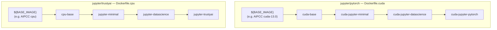

The following sections are aimed to provide a comprehensive guide for developers, enabling them to understand the project's architecture and seamlessly contribute to its development.

> **Note for AI Agents**: If you're an AI agent working with this repository, please refer to the [Agents Guide](../Agents.md) for specific instructions tailored to automated development workflows.

## Getting Started
This project utilizes three branches for the development: the **main** branch, which hosts the latest development, and **two additional branches for each release**.
These release branches follow a specific naming format: YYYYx, where "YYYY" represents the year, and "x" is an increasing letter. Thus, they help to keep working on minor updates and bug fixes on the supported versions (N & N-1) of each workbench.

## Architecture

Each notebook image has a self-contained multi-stage Dockerfile that starts from
`${BASE_IMAGE}` (an external base image) and rebuilds every ancestor stage internally.
No notebook image references another notebook image. The diagram below shows two
representative Dockerfiles side by side — each independently rebuilds the full stage
chain from its own base image:



Different images can reference different `${BASE_IMAGE}` values and therefore use
different CUDA/ROCm versions. For detailed architecture documentation, see
[ARCHITECTURE.md](../ARCHITECTURE.md).

Detailed instructions on how developers can contribute to this project can be found in the [contribution.md](https://github.com/opendatahub-io/notebooks/blob/main/CONTRIBUTING.md#some-basic-instructions-to-create-a-new-notebook) file. For testing procedures — including a step-by-step package upgrade checklist — see the [Testing Guide](agents/testing.md).

## Workbench ImageStreams

ODH supports multiple out-of-the-box pre-built workbench images ([provided in this repository](https://github.com/opendatahub-io/notebooks)). For each of those workbench images, there is a dedicated ImageStream object definition. This ImageStream object references the actual image tag(s) and contains additional metadata that describe the workbench image.

### **Annotations**

Aside from the general ImageStream config values, there are additional annotations that can be provided in the workbench ImageStream definition. This additional data is leveraged further by the [odh-dashboard](https://github.com/opendatahub-io/odh-dashboard/).

### **ImageStream-specific annotations**
The following labels and annotations are specific to the particular workbench image. They are provided in their respective sections in the `metadata` section.
```yaml
metadata:
  labels:
    ...
  annotations:
    ...
```
### **Available labels**
- **`opendatahub.io/notebook-image:`** - a flag that determines whether the ImageStream references a workbench image that is meant be shown in the UI
### **Available annotations**
- **`opendatahub.io/notebook-image-url:`** - a URL reference to the source of the particular workbench image
- **`opendatahub.io/notebook-image-name:`** - a desired display name string for the particular workbench image (used in the UI)
- **`opendatahub.io/notebook-image-desc:`** - a desired description string of the particular workbench image (used in the UI)
- **`opendatahub.io/notebook-image-order:`** - an index value for the particular workbench ImageStream (used by the UI to list available workbench images in a specific order)
- **`opendatahub.io/recommended-accelerators`** - a string that represents the list of recommended hardware accelerators for the particular workbench ImageStream (used in the UI)

### **Tag-specific annotations**
One ImageStream can reference multiple image tags. The following annotations are specific to a particular workbench image tag and are provided in its `annotations:` section.
```yaml
spec:
  tags:
    - annotations:
        ...
      from:
        kind: DockerImage
        name: image-repository/tag
      name: tag-name
```
### **Available per-tag annotations**
- **`opendatahub.io/notebook-software:`** - a string that represents the technology stack included within the workbench image. Each technology in the list is described by its name and the version used (e.g. `'[{"name":"CUDA","version":"11.8"},{"name":"Python","version":"v3.9"}]`')
- **`opendatahub.io/notebook-python-dependencies:`** - a string that represents the list of Python libraries included within the workbench image. Each library is described by its name and currently used version (e.g. `'[{"name":"Numpy","version":"1.24"},{"name":"Pandas","version":"1.5"}]'`)
- **`openshift.io/imported-from:`** - a reference to the image repository where the workbench image was obtained (e.g. `quay.io/repository/opendatahub/workbench-images`)
- **`opendatahub.io/workbench-image-recommended:`** - a flag that allows the ImageStream tag to be marked as Recommended (used by the UI to distinguish which tags are recommended for use, e.g., when the workbench image offers multiple tags to choose from)
- **`opendatahub.io/image-tag-outdated:`** - a flag that determines whether the image stream will be hidden from the list of available image versions in the workbench spawner dialog. Workbenches previously started with this image will continue to function.
- **`opendatahub.io/notebook-build-commit:`** - the commit hash of the notebook image build that was used to create the image. This is shown in Dashboard webui starting with RHOAI 2.22.

### **ImageStream definitions for the supported out-of-the-box images in ODH**

The ImageStream definitions of the out-of-the-box workbench images for ODH can be found [here](https://github.com/opendatahub-io/notebooks/tree/main/manifests).

### **Example ImageStream object definition**

An exemplary, non-functioning ImageStream object definition that uses all the aforementioned annotations is provided below.

```yaml
apiVersion: image.openshift.io/v1
kind: ImageStream
metadata:
  labels:
    opendatahub.io/notebook-image: "true"
  annotations:
    opendatahub.io/notebook-image-url: "https://github.com/example-workbench-source-repository/tree/path-to-source"
    opendatahub.io/notebook-image-name: "Example Jupyter Notebook"
    opendatahub.io/notebook-image-desc: "Exemplary Jupyter notebook image just for demonstrative purposes"
    opendatahub.io/notebook-image-order: "1"
    opendatahub.io/recommended-accelerators: '["nvidia.com/gpu", "amd.com/gpu"]'
  name: example-jupyter-notebook
spec:
  lookupPolicy:
    local: true
  tags:
  - annotations:
      opendatahub.io/notebook-software: '[{"name":"Python","version":"v3.9"}]'
      opendatahub.io/notebook-python-dependencies: '[{"name":"Boto3","version":"1.26"},{"name":"Kafka-Python","version":"2.0"},{"name":"Kfp-tekton","version":"1.5"},{"name":"Matplotlib","version":"3.6"},{"name":"Numpy","version":"1.24"},{"name":"Pandas","version":"1.5"},{"name":"Scikit-learn","version":"1.2"},{"name":"Scipy","version":"1.10"}]'
      openshift.io/imported-from: quay.io/opendatahub/workbench-images
      opendatahub.io/workbench-image-recommended: 'true'
    from:
      kind: DockerImage
      name: quay.io/opendatahub/workbench-images@sha256:value-of-the-image-tag
    name: example-tag-name
    referencePolicy:
      type: Source
```

## Continuous Integration

Each notebook image is built as an independent Konflux component with its own Tekton
PipelineRun (defined in `.tekton/`). Each pipeline:
- Points to its own Dockerfile and `build-args/*.conf` file
- Has its own CEL trigger watching relevant file paths
- Produces its own independently-versioned container image
- Uses hermetic dependency prefetch (Cachi2/Hermeto)

GitHub Actions handle static tests, security scanning, dependency updates, and digest
updates. See [AGENTS.md](../AGENTS.md) for the full list of CI files.

## GitHub Actions
This section provides an overview of the automation functionalities.

### **Piplock Renewal** [[Link]](https://github.com/opendatahub-io/notebooks/blob/main/.github/workflows/piplock-renewal-2023a.yml)

This GitHub action is configured to be triggered on a weekly basis, specifically every Monday at 22:00 PM UTC. Its main objective is to automatically update the Pipfile.lock files by fetching the most recent minor versions available. Additionally, it also updates the hashes for the downloaded files of Python dependencies, including any sub-dependencies. Once the updated files are pushed, the CI pipeline is triggered to generate new updated images based on these changes.

### **Sync the downstream release branch with the upstream** [[Link]](https://github.com/red-hat-data-services/rhods-devops-infra/blob/main/.github/workflows/upstream-auto-merge.yaml)

This GitHub action is configured to be triggered on a daily basis and synchronizes the selected projects from their upstream repositories to their downstream counterparts.

### **Quay security scan** [[Link]](https://github.com/opendatahub-io/notebooks/blob/main/.github/workflows/sec-scan.yml)

This GitHub action is designed to be triggered on a weekly basis. It generates a summary of security vulnerabilities reported by [Quay](https://quay.io/) for the latest images built for different versions of notebooks.

[Previous Page](https://github.com/opendatahub-io/notebooks/wiki/Workbenches) | [Next Page](https://github.com/opendatahub-io/notebooks/wiki/User-Guide)
