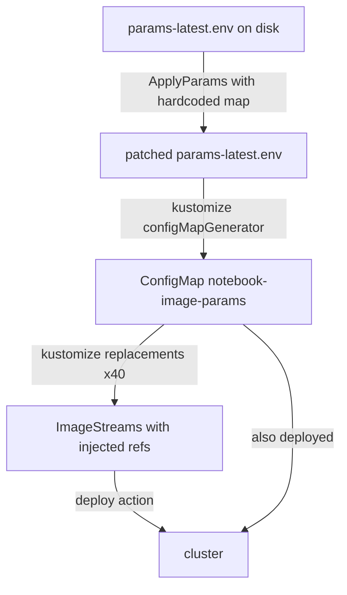

# Notebook Image Manifests

## Applying the manifests

The manifests in this directory define OpenShift `ImageStream` resources for
all notebook workbench and runtime images.  To render them locally:

```bash
# Render from the base layer (image refs + commit hashes injected via kustomize)
kustomize build manifests/base

# Render from the overlay (adds component labels on top of base)
kustomize build manifests/overlays/additional
```

The overlay at `overlays/additional/` adds two labels
(`component.opendatahub.io/name: notebooks` and
`opendatahub.io/component: "true"`) and is otherwise identical to `base/`,
since we don't have any "additional" notebooks at the time of this writing.

## How the operator applies these manifests

The [odh-platform/rhods-operator](https://github.com/red-hat-data-services/rhods-operator)
consumes this directory at deploy time.  The flow has several layers of
indirection ([notebooks#2982](https://github.com/opendatahub-io/notebooks/issues/2982)):



1. The operator reads `params-latest.env` and patches each key's value with
   the corresponding `RELATED_IMAGE_*` environment variable (set at build
   time from the operator's `ClusterServiceVersion`).
2. Kustomize's `configMapGenerator` turns the `.env` files into a `ConfigMap`.
3. The `replacements` section injects each ConfigMap entry into the matching
   `ImageStream` tag's `spec.tags[N].from.name` (image ref) and
   `spec.tags[N].annotations[opendatahub.io/notebook-build-commit]` (commit hash).
4. The rendered resources are applied to the cluster.

## Maintaining the manifests

### File layout

```
manifests/base/
  kustomization.yaml          # generated -- do not edit by hand
  params.env                  # image refs for released versions (e.g. -2025-2)
  params-latest.env           # image refs for the latest/N version (suffix -n)
  commit.env                  # commit hashes for released versions
  commit-latest.env           # commit hashes for the latest/N version
  *-imagestream.yaml          # ImageStream definitions (workbenches + runtimes)
```

### Generating kustomization.yaml

The `kustomization.yaml` is generated from the `.env` files and ImageStream
YAML files by a script.  After changing any `.env` file or adding/removing
an ImageStream, regenerate it:

```bash
uv run manifests/base/generate_kustomization.py            # write kustomization.yaml
uv run manifests/base/generate_kustomization.py --check    # verify it matches (CI)
uv run manifests/base/generate_kustomization.py --stdout   # preview without writing
```

### Consistency rules

Each workbench ImageStream tag must satisfy these rules:

- **Tag ordering**: tags are listed newest to oldest.
- **Placeholder suffix**: the first tag (latest) uses suffix `-n`; every
  subsequent tag's `from.name` and `notebook-build-commit` placeholders use a
  suffix matching the tag `name:` with `.` replaced by `-`
  (e.g. tag `"2025.1"` uses suffix `-2025-1`).
- **Commit placeholder**: mirrors the `from.name` placeholder with `-commit`
  inserted before the version suffix.
- **Env key existence**: every placeholder key must appear in `params.env` /
  `params-latest.env` (and commit keys in `commit.env` / `commit-latest.env`).
- **Kustomization replacement**: every `(imagestream, tag index)` pair must
  have a matching replacement block in `kustomization.yaml`.

These rules are enforced by a test:

```bash
uv run pytest tests/test_main.py::test_imagestream_kustomization_consistency -v
```
